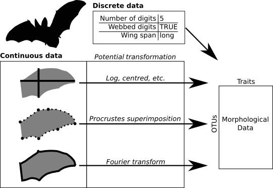

```{r}
## The packages to load for the section
library(dispRity)
library(ape)
library(treats)
```

# From observations to traitspaces

Here we will look how to go from some observations to a traitspace in `R`.
This step allows us to go from observed/collected data into a multidimensional traitspace that we can then analyse further for our research.



## Morphological traits

### Morphological traits in the age of molecular data?

In a recent paper I reviewed (hopefully to be published soon - it's going to be a super useful piece of work for the community!), the authors made a distinction between molecular characters being objective and morphological ones being subjective.
The common idea is that you put some DNA in a machine and get some sequence of letters out of it (ACTG) which appears to be more objective than going into a museum and comparing specimens with your expert eyes.
And here's my rant on why I disagree:

TL;DR:
I think the comparison "molecular = objective" and "morphological = subjective" is a false comparison.
This might be because of a dual meaning of these two words:

 * Subjectivity and objectivity as a epistemoligical concept where something is subjective when it's link to a person's experience and something is objective when it's not. But both morphological and molecular characters are mostly objective in their description (i.e. the character is not linked to a person's experience) but mostly subjective in their use (i.e. the character's usage is linked to a person's experience)/ 
 * But also in research we tend to associate these words to a moral judgment when referring to our work: objective = good and subjective = bad. Which again is both true and false for any character: we should use the method best adapted to a certain type of character (to our knowledge) so the character is always, in that sense _objectively_ good (in a subjective sense; i.e. to the best of our knowledge).

Regarding the first meaning (epistemological):
Although molecular characters are objective (there is a nucleotide "A" in position _n_ on gene Y regardless of a person's experience), morphological characters can be equally objective (there are 4 cusps on this teeth; or in continuous terms: this bone is longer than another one).
Furthermore, often authors are not only interested in the characters (molecular and morphological) but how they are used for a research purpose (e.g. building a tree).
This comes with many arbitrary decisions in both cases (i.e. subjective choice - not bad choices, _cf_ the second meaning of the words below).
For example, workers building phylogenies based on molecular characters have to make a lot of arbitrary decisions on which genes to use based on time, cost and availability constraints.
Maybe the comparison should be more along the lines of "molecular = easier to automatise" and "morphological = harder to automatise" (although both are probably not true when diving into it: this was true 20 years ago, less so nowadays).

Regarding the second meaning (moral judgment; objective = good, subjective = bad):
Although continuous measurements appear to be more objective (_sensu_ 1st meaning: "bone A is of length X") and this _better_ for the aim of the worker (_sensu_ 2nd meaning; "it's better to use continuous characters to build a morphological tree" - see this one by the way: @parins2018use).
It might not be the case when choosing another method (subjective; _sensu_ 1st meaning) where discrete morphological characters are more subjective (_sensu_ 1st meaning; an expert chose to spend time encoding character X rather than character Y) but it leads to _better_ results depending on the method (_sensu_ 2nd meaning; when using parsimony, trees are better when expert chose the characters - i.e. the trees end up being more useful to the community).
This applies also to molecular characters when workers tend to use the GTR model with 4 categories of rates approximating a Gamma distribution (rarely another number).
This can be equally seen as a subjective choice (1st meaning) leading to an objective improvement (2nd meaning). 

### Continuous trait data

This method is one of the easiest.
Continuous data is often measured as standard physical units (e.g. meters, grams, seconds, etc.) and can be read directly from a data file in `R`.
On easiest data file format is `csv` ("comma separated values") that is easily generated from most spreadsheet editor (usually they have an option "Save As... > .csv").
These files look something like this:

```
         ,variable 1, variable 2
species_a, 1.23, 4.56
species_b, 7.89, 0.12
```

and can be read in `R` using `read.csv`.

<div class="warning" style='padding:0.1em; background-color:#5D7BBB; color:#092663'>

**USE YOUR DATA**: load your own continuous data

```{r, eval = FALSE}
my_continuous_data <- read.csv("path_to_my_file.csv")
```

You can also use `read.csv(..., row.names = <column_number>` to directly read one column as the rownames:

```{r, eval = FALSE}
my_continuous_data <- read.csv("path_to_my_file.csv", row.names = 1)
```
</div>

### Discrete trait data

#### Glossary

There are many specific terms when coming to discrete morphological characters, here is a list of some that I use (though note that the definitions here are my own, there is no standard or correct one!).
My version is heavily inspired by @brazeau2011problematic.

 * **character**: this is a trait (e.g.: "snout length")
 * **state**: this is one of the potential discrete value the state can have for a specific species (e.g. "snout length: short, long")
 * **token**: this the symbol used to represent the state for a specific character (e.g. "snout length: short (0), long (1)")
 * **ordered**/**unordered**: this designates whether the character is ordered (e.g. "snout length: short, medium, long") or whether it is unordered (e.g. "habitat: aquatic, arboreal, fossorial")
 * **ambiguity**: this designates whether the state for a specific species is known or not (see possible list below):
 * **missing**: this is when the ambiguity is unknown: e.g. the feature to describe the character is not available. This is often encoded with the token `"?"`.
 * **inapplicable**: this is when the ambiguity is known but not relevant: e.g. the character "Wing colour" for a dog (it's not missing, it just doesn't exist). This is often encoded with the token `"-"`.
 * **uncertain**: this is when the state is unknown but only between certain states. For example, for a character "snout length: short(0), medium(1), long(2)" for a fossil species with a damaged snout (but that doesn't look short), we could code it as either "medium OR long" (often using the tokens: `"1/2"`).
 * **polymorphic**: this is when a state has multiple observed states. For example, for the same character as before, a species could have both mediums AND long snouts (depending on the specimens). It is then often encoded using the tokens `"1&2"`.

Discrete characters can be stored in a simple spreadsheet as for continuous traits:

```
         ,character 1, character 2
species_a, 0, ?
species_b, 0, 1
```

They can be input using the `read.csv` function as above. Easy.

But more commonly, discrete morphological characters are stored in `.nexus`/`.nex` files.
These are standardised comparative methods files with meta data and a list of characters.
They are very commonly used both for molecular and morphological data.
You can recognise them easily, they always start on the first line with `#NEXUS` and can contain more or less a lot of metadata.
I'm not going to go in the details here but most of the time you can read them easily with `ape::read.nexus.data` or `Claddis::read_nexus_matrix`.


<div class="warning" style='padding:0.1em; background-color:#5D7BBB; color:#092663'>

**USE YOUR DATA**: load your own discrete data

```{r, eval = FALSE}
discrete_traits <- read.nexus.data("path_to_my_file.nex")
```
</div>

Note that they can be a bit more complicated to input depending on how they were formated.
Sometimes they require a bit of editing to avoid error messages.
Here is a comprehensive list of things to look out for when importing discrete morphological characters:

 * SPACES! 

That's it. Basically all the problems come from extra spaces in the matrix chunk in the nexus file. To avoid any: only use spaces to separate the element name (species, genera, specimen, etc.) and the string of characters.
For example this is a good format:

```
species_name 0100010???{01}11(01)001
```

But all these are gonna create problems:

```
species name 0100010???{01}11(01)001
species_name 010001 0???{01}1 1(01)001
species_name 0100010???{0 1}11(0 1)001
```

<!-- ### Geometric morphometric data 

TODO

-->

## Ordinations

Method | Variables | Distances | `R` functions
-------|-----------|----------------|---------------
Principal component analyses (PCA) | Continuous | Euclidean (no need for a distance matrix) | `stats::prcomp`, `stats::princomp`
Principal coordinates analysis (PCO, PCoA), Multidimensional scaling (MDS), Non-metric MDS (NMDS) | Continuous, discrete, complex | Any distance (needs a distance matrix) | `stats::cmdscale`

(table adapted from @legendre2012numerical).

### Principal components analyses (PCA)

[SLIDES: PCA](../)
<!-- gitraw link slides/01.1_PCA.pdf-->

<div class="warning" style='padding:0.1em; background-color:#FFAF70; color:#954200'>

**CATCHING UP ZONE**: here's some example of continuous data if you didn't import your own.
This is a dataset of 24 continuous measurements from 60 observations (species of skinks) from @brennan2024evolutionary :

```{r}
## Continuous data
continuous_data <- read.csv("../examples/continuous_characters/Brennan2024.csv",
                            row.names = 1)
```
</div>

To do a PCA, it's pretty simple, you can use the function `prcomp` or `princomp`.
They are very different function in that they do the exact same things but their outputs have different names.
To access the PCA matrix for `prcomp` you need to call `my_pca$x` and for `princomp` it's `my_pca$scores`.
But they're fundamentally the same thing.
Here's how to compute it as well as measuring the loadings, i.e. the amount of variance explained per dimensions:

```{r}
## Ordinating some data with prcomp
my_ordination <- prcomp(continuous_data)
## Getting the trait space
my_traitspace <- my_ordination$x
## Measuring the "loading" (the variance per dimension)
my_loadings <- apply(my_traitspace, 2, var)/sum(apply(my_traitspace, 2, var))
```

Alternatively you can calculate the loadings by using the `$sdev` component that is the square root of the eigenvalues (so the loadings are the scaled squared `$sdev` component) but personally I prefer calculating it using the variance (I find it easier to understand).

```{r}
## Alternatively variance loading calculation
my_ordination$sdev^2/sum(my_ordination$sdev^2)
```

Visualising the ordination of the data:

```{r, fig.height = 6, fig.width = 12}
op <- par(mfrow = c(1,2))
## Plotting the original data
plot(my_traitspace[, c(1,2)],
     xlab = "dimension 1", ylab = "dimension 2", pch = 19)
## Adding another plot with the loadings
barplot(my_loadings, ylab = "% variance")
par(op)
```

### Principal coordinates analysis (PCO)

<div class="warning" style='padding:0.1em; background-color:#FFAF70; color:#954200'>

**CATCHING UP ZONE**: here's some example of discrete data if you didn't import your own.
This is a dataset from @beck2014ancient of 106 mammal species (mainly fossils) and 421 characters.

```{r}
## 421 discrete morphological characters
discrete_traits <- read.nexus.data("../examples/discrete_characters/Beck2014.nex")
## Combine the output list into a matrix (rows are species and columns are characters)
traits_matrix <- do.call(rbind, discrete_traits)
```

</div>

PCOs are also pretty easy but unlike PCAs they require one extra step before ordinating the variance-covariance: calculating the distance matrix.

#### Distance matrices

[SLIDES: PC0](../)
<!-- gitraw link slides/01.2_PC0.pdf-->

There are many ways to calculate distance matrices from discrete morphological characters.
See this very good review for more information: @lloyd2016estimating.
In short the type of distance metric should depend on the quality of your data (amount of missing or uncertain data) and the type of characters (binary, ordered or not, etc.).

The most comprehensive way to measure distance matrices can be done by using the `Claddis::calculate_morphological_distances` which allows for many many options to tailor the distance metric (and special behaviours) to your own dataset.

However, here we will be using the more generic `dispRity::char.diff` function that is faster but is designed for a more general purpose so lacks some of the options from `Claddis`.

```{r}
## Calculating the maximum observable distance
distance_matrix <- char.diff(traits_matrix, method = "mord", by.col = FALSE)
```

Note that here we are going all by default which is useful to get everyone on board for a workshop but is definitely not what you should do for your research!
Always have a look at the default hidden options and what they're doing!

For example in this instance with the data from @beck2014ancient we treated all the characters as unordered (you can change that with the option `order = c(TRUE, FALSE, TRUE, ...)` for every character if they are to be treated as ordered (`TRUE`) or not (`FALSE`)).
Also, we have decided to treat encoded ambiguities in a standard default way where question marks (`"?"`) are treated as missing values and interpreted as all possible character states and `"\"` designated ambiguous characters and where treated as any ambiguous state marked here (e.g. `"0\2"` is either state `0` or `2` - but not any other state, e.g. `1`).
You can personalise the way you want to interpret these characters by giving a different list of token definition and 

```{r}
## Calculating the maximum observable distance
distance_matrix2 <- char.diff(traits_matrix, method = "mord", by.col = FALSE,
                              # defining the special token and it's name
                              special.tokens = c("missing" = "\\?"),
                              # defining the behaviour (always returning 1, the first state)
                              special.behaviour = list(missing = function(x,y) return(1))
                              )
```

This change results in a very different distance matrix (and is probably not very pertinent for this specific dataset!).


```{r, fig.height = 6, fig.width = 12}
op <- par(mfrow = c(1,2))
## Plotting the original data
plot(distance_matrix, main = "? = any state")
## Adding another plot with the loadings
plot(distance_matrix2, main = "? = state 0")
par(op)
```

<div class="warning" style='padding:0.1em; background-color:#65D85F; color:#067800'>

**TINKER TIMES**: You can also play around with the different type of distance metrics and see how that affects the results by changing the option `method`.
Have a read in the manual for the details (`?char.diff`).

<details>
  <summary>[**Click to expand the solution**]:
</summary>

```{r, fig.height = 12, fig.width = 12}
## Four different metrics
distance_mord      <- char.diff(traits_matrix, method = "mord", by.col = FALSE)
distance_hamming   <- char.diff(traits_matrix, method = "hamming", by.col = FALSE)
distance_euclidean <- char.diff(traits_matrix, method = "euclidean", by.col = FALSE)
distance_manhattan <- char.diff(traits_matrix, method = "manhattan", by.col = FALSE)

## Plotting the results
op <- par(mfrow = c(2,2))
plot(distance_mord, main = "mord")
plot(distance_hamming, main = "hamming")
plot(distance_euclidean, main = "euclidean")
plot(distance_manhattan, main = "manhattan")
par(op)
```

</details>
</div>

#### PCO

Once you have a distance matrix, you can ordinated it using the `cmdscale` function which works similarly to a Principal Components Analysis.
One minor subtlety though is that you have to choose the number of dimensions (`k`) and might or might not use a correction to treat the distance matrix as Euclidean or not.
Regarding the number of dimensions, a good practice is to use the number of species minus 2 to allow for the biggest spread of the variance (i.e. to avoid cramming the variance in the first dimensions).
Regarding the correction, if you don't use a simple Euclidean distance metric, use the option `add = TRUE` to use the @cailliez1983analytical correction (which adds an estimated constant to make the distances Euclidean).

```{r}
## Ordinating a distance matrix
my_pco <- cmdscale(distance_matrix,
                   # the number of dimensions
                   k = ncol(distance_matrix)-2,
                   # the Cailliez correction
                   add = TRUE)

## Getting just the coordinates
my_traitspace <- my_pco$points
my_loadings <- apply(my_traitspace, 2, var)/sum(apply(my_traitspace, 2, var))
```

And we can visualise the first two dimensions and the distribution of the variance per dimensions:

```{r, fig.height = 6, fig.width = 12}
op <- par(mfrow = c(1,2))
## Plotting the original data
plot(my_traitspace[, c(1,2)],
     xlab = "dimension 1", ylab = "dimension 2", pch = 19)
## Adding another plot with the loadings
barplot(my_loadings, ylab = "% variance")
par(op)
```

<!--
## Missing data 
-->

## Estimating ancestral traits

### Reading trees into `R`

Reading phylogenetic trees in R is rather easy: you can use either the `ape::read.tree` function for reading a tree in newick format (a text file starting with "(") or `ape::read.nexus` for reading a nexus tree (a text file starting with "#NEXUS"). 

> `read.tree` or `read.nexus`? Can't decide which one to use? You can use this custom made function that will always decide for you:

```{r}
read.any.tree <- function(file) {
    ## Check whether the first line of the file is "#NEXUS"
    if(scan(what = "#NEXUS", file = file, nlines = 1, quiet = TRUE) == "#NEXUS") {
        ## The tree is a true nexus
        return(read.nexus(file))
    } else {
        ## The tree is a true newick
        return(read.tree(file))
    }
}
```

```{r, eval = FALSE}
## Reading a newick tree
my_tree <- read.tree("path_to_my_file.newick")
## Reading a nexus tree
my_tree <- read.nexus("path_to_my_file.nexus")
## Reading any tree
my_tree <- read.any.tree("path_to_my_file.dontknow")
```

<div class="warning" style='padding:0.1em; background-color:#FFAF70; color:#954200'>

**CATCHING UP ZONE**: here's some example of discrete and continuous data and tree if you didn't import your own.

This first chunk is a continuous dataset of 24 measurements from 60 observations (species of skinks) from @brennan2024evolutionary :

```{r}
## Get the continuous
continuous_data <- read.csv("../examples/continuous_characters/Brennan2024.csv",
                            row.names = 1)
## Get the tree
continuous_tree <- read.tree("../examples/trees/Brennan2024.tre")

## Adding node labels
continuous_tree <- makeNodeLabel(continuous_tree)

## Cleaning both the tree and the data to match
cleaned_data    <- clean.data(data = continuous_data, tree = continuous_tree)
continuous_data <- cleaned_data$data
continuous_tree  <- cleaned_data$tree
## The following were dropped:
cleaned_data$dropped_rows
cleaned_data$dropped_tips
```

This second chunk is a discrete dataset from @beck2014ancient of 106 mammal species (mainly fossils) and 421 characters and the associated tree.

```{r}
## Get discrete data
discrete_traits <- read.nexus.data("../examples/discrete_characters/Beck2014.nex")
## Combine the output list into a matrix (rows are species and columns are characters)
discrete_data <- do.call(rbind, discrete_traits)
## Get the tree
discrete_tree <- read.nexus("../examples/trees/Beck2014.tre")

## Cleaning both the tree and the data to match
cleaned_data  <- clean.data(data = discrete_data, tree = discrete_tree)
discrete_data <- cleaned_data$data
discrete_tree <- cleaned_data$tree
## The following were dropped:
cleaned_data$dropped_rows
cleaned_data$dropped_tips
```

</div>

### Estimating ancestral traits

There are many ways to estimate ancestral trait data in which I will not go into to much details.
I will not go into the details on _how_ ancestral traits are calculated because 1) that would be a whole course on likelihood estimation and model fitting and 2) all that would just be to calculate "glorified" averages.
So for this reason I'm just going to focus on on way to do it but note that there are many ways to do it and many options to consider.
My favourites are:

 * `ape::ace` for estimating ancestral traits for both continuous and discrete traits.
 * `dispRity::multi.ace` an updated version of `ape::ace` dealing with continuous characters and discrete ones (but with more options) and that can handle tree distributions (we will look at this one here).
 * `Claddis::estimate_ancestral_states` which is more specialized in estimating ancestral states for discrete characters. It noticeably has cool models for dealing with inapplicable data!

> Note that I have strong personal views on estimating ancestral traits: it is a useful tool for running some analyses (as we will see in next chapters) but it remains a very an impossible task, no matter how good the model and the data: unless we observe ancestral data (e.g. in the fossil record) we can only have a more or less vague idea of what the ancestral trait value could have been. If you use such methods for your research, I highly suggest you don't use point estimates (i.e. single values) but rather distributions: both for the estimate and for the tree topology used for the estimation.

```{r}
## Selecting a specific trait:
snout_vent <- continuous_data[,1]
names(snout_vent) <- rownames(continuous_data)

## Estimating the ancestral states for this trait
ancestral_snout_vent <- ace(snout_vent, continuous_tree)

## Combining the tips and the ancestral values
ancestral_values <- ancestral_snout_vent$ace
snout_vent_data <- as.matrix(data.frame("snout vent" = c(snout_vent, ancestral_values)))

## Plotting the data (using the treats package)
treats_data <- make.treats(continuous_tree, data = snout_vent_data)
plot(treats_data)
```

This look all good and realistic (i.e. the ancestor of this group has a trait value that is a scaled average of the observed species).
However, if we have a look at the errors around the estimations, we have a whole different story!

```{r}
## Plotting the trait data
plot(treats_data, ylim = range(ancestral_snout_vent$CI95))
abline(h = 0, lty = 2, lwd = 0.2)
## Get the node ages
node_ages <- tree.age(continuous_tree)$age[-c(1:Ntip(continuous_tree))]
## Get the 95% confidence interval for each node estiamte
confidence_intervals <- ancestral_snout_vent$CI95
## Plotting each confidence interval
for(one_node in 1:Nnode(continuous_tree)) {
  lines(x = rep(node_ages[one_node], 2), y = confidence_intervals[one_node,], col = "orange", lwd = 0.5)
}
```

So that's not that great!

#### How to improve this mess?

 * Be cautious about ancestral state estimations: they are just that (estimations! - not *reconstructions*).
 * Whenever possible, use multiple trees to account for topological error.
 * Whenever possible, use the distribution of estimates rather than point estimates.
 * Whenever possible, use multiple traits rather than a single one.

But for now we can just go ahead and keep these caveats in mind.
You can use the `dispRity::multi.ace` function to estimate ancestral trait values for large datasets and use tree distributions:

```{r}
## Running the ancestral states for all the traits (it should take a couple of seconds)
ancestral_states <- multi.ace(continuous_data, continuous_tree)
```

With the same caveats in mind, we can do the same for discrete traits using still `multi.ace`.
Note that some of the syntax here is the same as we've seen for `char.diff`: there is a lot of room for personalisation to tailor the token interpretations and behaviour, the models, etc...
Here we will use the option `output = "combined"` to get a combined matrix (tips + nodes) for ease of use.

```{r}
## Estimating ancestral traits for discrete characters characters
ancestral_states <- multi.ace(discrete_data, discrete_tree, output = "combined")
```

We can then use this new matrix with ancestral states to re-calculate distances (the same as before but including the nodes).

<div class="warning" style='padding:0.1em; background-color:#65D85F; color:#067800'>

**TINKER TIMES**: see if you remember how to do it by just copy/pasting chunks from above.

<details>
  <summary>[**Click to expand the solution**]:
</summary>

```{r, fig.height = 6, fig.width = 12}
## Calculating the distance matrix
distance_matrix <- char.diff(ancestral_states, method = "mord", by.col = FALSE)

## Ordinating the data
my_pco <- cmdscale(distance_matrix,
                   # the number of dimensions
                   k = ncol(distance_matrix)-2,
                   # the Cailliez correction
                   add = TRUE)

## Getting just the coordinates
my_traitspace <- my_pco$points
my_loadings <- apply(my_traitspace, 2, var)/sum(apply(my_traitspace, 2, var))

op <- par(mfrow = c(1,2))
## Plotting the original data
plot(my_traitspace[, c(1,2)],
     xlab = "dimension 1", ylab = "dimension 2", pch = 19)
## Adding another plot with the loadings
barplot(my_loadings, ylab = "% variance")
par(op)
```

</details>
</div>

## References